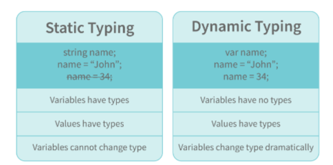

# 1 JavaScript Ma'lumotlar Turlari

JavaScript dasturlash tilida quyidagi ma'lumotlar turlari mavjud:

## 1. Primitiv Turlar

Primitiv turlar faqat bitta qiymatni saqlashga imkon beradi. Quyidagi primitiv ma'lumot turlari mavjud:

String - U bir qator belgilarni ifodalaydi va tirnoq bilan yoziladi. Satr bitta yoki ikkita tirnoq yordamida ifodalanishi mumkin.

Number - Bu raqamni ifodalaydi va o'nli yoki o'nli kasrlarsiz yozilishi mumkin.

BigInt - Ushbu ma'lumotlar turi Raqamli ma'lumotlar turi chegarasidan yuqori bo'lgan raqamlarni saqlash uchun ishlatiladi. U katta butun sonlarni saqlashi mumkin va butun son harfiga “n” qoʻshish orqali ifodalanadi.

Boolean - Bu mantiqiy ob'ektni ifodalaydi va faqat ikkita qiymatga ega bo'lishi mumkin: rost yoki noto'g'ri. Booleanlar odatda shartli sinov uchun ishlatiladi.

Undefined - o'zgaruvchi e'lon qilingan, lekin tayinlanmagan bo'lsa, u undefined qiymatiga ega va uning turi ham aniqlanmagan.

Null - u mavjud bo'lmagan yoki noto'g'ri qiymatni ifodalaydi.

Symbol - Bu javascriptning ES6 versiyasida kiritilgan yangi ma'lumotlar turi. U anonim va noyob qiymatni saqlash uchun ishlatiladi.

## 2. Primitiv bo'lmagan turlar

Primitiv ma'lumotlar turlari faqat bitta qiymatni saqlashi mumkin. Bir nechta va murakkab qiymatlarni saqlash uchun primitiv bo'lmagan ma'lumotlar turlari qo'llaniladi.

Ob'ekt - ma'lumotlar to'plamini saqlash uchun ishlatiladi.

## 2 Javascriptda Hoistingni tushuntiring.

Hoisting ko'tarish JavaScript-ning standart xatti-harakati bo'lib, unda barcha o'zgaruvchilar va funksiya deklaratsiyasi tepaga ko'chiriladi.

Bu shuni anglatadiki, o'zgaruvchilar va funktsiyalar qayerda e'lon qilinganidan qat'i nazar, ular qamrovning yuqori qismiga ko'chiriladi. Qamrov ham mahalliy, ham global bo'lishi mumkin.

## 3 Nima uchun javascriptda “debugger” so‘zini ishlatamiz?

Kodni disk raskadrovka qilish uchun brauzer uchun tuzatuvchi faollashtirilgan bo'lishi kerak. O'rnatilgan tuzatuvchilarni yoqish va o'chirish mumkin, bu esa foydalanuvchidan nosozliklar haqida xabar berishni talab qiladi. Kodning qolgan qismi disk raskadrovka paytida keyingi qatorga o'tishdan oldin bajarilishini to'xtatishi kerak.

## 4 “ == “ and “ === “ operatorlari orasidagi farq.

Ikkalasi ham taqqoslash operatorlari. Ikkala operator o'rtasidagi farq shundaki, "==" qiymatlarni solishtirish uchun ishlatiladi, " ===" esa ikkala qiymat va turlarni solishtirish uchun ishlatiladi.

## 5 Javascriptdagi var va let kalit so'zlari orasidagi farq.

Eng boshidan JavaScript dasturlashda "var" kalit so'zi ishlatilgan bo'lsa, "let" kalit so'zi 2015 yilda qo'shilgan.

"Var" kalit so'zi funksiya doirasiga ega. Funktsiyaning istalgan joyida var yordamida ko'rsatilgan o'zgaruvchiga kirish mumkin, lekin "let" da "let" kalit so'zi bilan e'lon qilingan o'zgaruvchining doirasi u e'lon qilingan blok bilan cheklangan. Block Scope bilan boshlaylik.

ECMAScript 2015 da let va const ko'tariladi, lekin ishga tushirilmaydi. O'zgaruvchini e'lon qilishdan oldin blokdagi o'zgaruvchiga havola qilish ReferenceErrorga olib keladi, chunki o'zgaruvchi blok boshlanganidan to deklaratsiyaga ishlov berilgunga qadar "vaqtinchalik o'lik zonada" bo'ladi.

## 6 Javascriptda Implicit Type Coercionni tushuntiring.

JavaScript-da yashirin turdagi majburlash - bu qiymatni bir ma'lumot turidan ikkinchisiga avtomatik ravishda o'zgartirish. Ifodaning operandlari har xil turdagi ma'lumotlarga ega bo'lganda sodir bo'ladi.

## String majburlash

'+' operatoridan foydalanganda string majburlash sodir bo'ladi. Satrga raqam qo'shilganda, raqam turi har doim satr turiga aylanadi.

Eslatma - ' + ' operatori ikkita raqamni qo'shish uchun ishlatilsa, raqamni chiqaradi. Xuddi shu '+' operatori ikkita satr qo'shish uchun ishlatilsa, birlashtirilgan qatorni chiqaradi:

## Boolean majburlash

Mantiqiy majburlash mantiqiy operatorlar, uchlik operatorlar, if operatorlari va sikl tekshiruvlaridan foydalanganda amalga oshiriladi. If iboralari va operatorlarida mantiqiy majburlashni tushunish uchun biz haqiqat va yolg'on qadriyatlarni tushunishimiz kerak. Haqiqiy qadriyatlar - bu haqiqatga

aylantiriladigan (majburiy) . Noto'g'ri qiymatlar noto'g'ri qiymatga aylantiriladigan qiymatlardir . False, 0, 0n, -0, “”, null, undefined va NaN dan tashqari barcha qiymatlar rost qiymatlardir.2

## Mantiqiy operatorlar:

Javascriptdagi mantiqiy operatorlar boshqa dasturlash tillaridagi operatorlardan farqli o'laroq, rost yoki yolg'onni qaytarmaydi. Ular har doim operandlardan birini qaytaradilar.

OR ( | | ) operatori - Agar birinchi qiymat haqiqat bo'lsa, birinchi qiymat qaytariladi. Aks holda, har doim ikkinchi qiymat qaytariladi.

AND ( && ) operatori - Agar ikkala qiymat ham to'g'ri bo'lsa, har doim ikkinchi qiymat qaytariladi. Agar birinchi qiymat noto'g'ri bo'lsa, birinchi qiymat qaytariladi yoki ikkinchi qiymat noto'g'ri bo'lsa, ikkinchi qiymat qaytariladi.

## Tenglikka majburlash

Tenglikka majburlash ' == ' operatoridan foydalanganda amalga oshiriladi. Yuqorida aytib o'tganimizdek,

' == ' operatori turlarni emas, balki qiymatlarni taqqoslaydi.

Yuqoridagi gap == operatorini tushuntirishning oddiy usuli bo'lsa-da, bu mutlaqo to'g'ri emas

Haqiqat shundaki, '==' operatoridan foydalanganda majburlash sodir bo'ladi.

'==' operatori ikkala operandni bir xil turga aylantiradi va keyin ularni solishtiradi.

'===' operatoridan foydalanganda majburlash amalga oshirilmaydi. '===' operatorida ikkala operand ham bir xil turga aylantirilmaydi.

## 7 Javascript statik yoki dinamik terilgan tilmi?

JavaScript dinamik ravishda terilgan tildir. Dinamik tarzda terilgan tilda, o'zgaruvchining turi kompilyatsiya vaqtida tekshiriladigan statik tarzda yozilgan tildan farqli o'laroq, o'zgaruvchining turi ish vaqtida tekshiriladi.

Javascript erkin (dinamik) terilgan til bo'lgani uchun JSdagi o'zgaruvchilar hech qanday tur bilan bog'lanmaydi. O'zgaruvchi har qanday turdagi ma'lumotlarning qiymatini ushlab turishi mumkin.

## 8 JavaScript-da NaN xossasi nima?

NaN xususiyati "Raqam emas" qiymatini ifodalaydi. Bu qonuniy raqam bo'lmagan qiymatni bildiradi.

typeof of NaN raqamni qaytaradi .

Qiymat NaN ekanligini tekshirish uchun isNaN() funksiyasidan foydalanamiz,

Eslatma- isNaN() funksiyasi berilgan qiymatni Raqam turiga aylantiradi va keyin NaN ga tenglashadi.

## 9 Qiymat bo'yicha o'tgan va mos value bo'yicha o'tganlarni tushuntiring.

Qiymat bo'yicha o'tgan va mos yozuvlar orqali o'tgan tushunish uchun biz o'zgaruvchini yaratganimizda va unga qiymat berganimizda nima sodir bo'lishini tushunishimiz kerak,

Yuqoridagi misolda biz x o'zgaruvchisini yaratdik va unga "2" qiymatini berdik. Orqa fonda "=" (tayinlash operatori) xotirada bir oz joy ajratadi, "2" qiymatini saqlaydi va ajratilgan xotira maydonining o'rnini qaytaradi. Shuning uchun, yuqoridagi koddagi x o'zgaruvchisi to'g'ridan-to'g'ri 2 qiymatini ko'rsatish o'rniga xotira maydonining joylashgan joyiga ishora qiladi.

Assign operatori ibtidoiy va ibtidoiy bo'lmagan ma'lumotlar turlari bilan ishlaganda o'zini boshqacha tutadi,

Yuqoridagi misolda tayinlash operatori y ga tayinlangan qiymat ibtidoiy tip ekanligini biladi (bu holda raqam turi), shuning uchun ikkinchi qator kodi bajarilganda, y qiymati z ga tayinlanganda, tayinlash operatori y qiymati (234) va xotirada yangi joy ajratadi va manzilni qaytaradi. Shuning uchun, z o'zgaruvchisi y o'zgaruvchining joylashgan joyini emas, balki xotiradagi yangi joyni ko'rsatmoqda.

Yuqoridagi misoldan ko'rishimiz mumkinki, ibtidoiy ma'lumotlar turlari boshqa o'zgaruvchiga o'tkazilganda qiymat bo'yicha uzatiladi. Xuddi shu manzilni boshqa o'zgaruvchiga belgilash o'rniga, qiymat uzatiladi va yangi xotira maydoni yaratiladi.

Primitiv bo'lmagan ma'lumotlar turlarini o'tkazishda tayinlangan operator manzilni (ma'lumotnoma) to'g'ridan-to'g'ri uzatadi.

Shuning uchun primitiv bo'lmagan ma'lumotlar turlari har doim mos yozuvlar orqali uzatiladi.

## 10 JavaScript-da darhol chaqiriladigan funksiya nima?

Darhol chaqiriladigan funktsiya (IIFE deb nomlanadi va IIFY deb talaffuz qilinadi) bu aniqlangandan so'ng darhol ishlaydigan funksiya.

IIFE-ni tushunish uchun biz IIFE yaratishda qo'shiladigan ikkita qavs to'plamini tushunishimiz kerak:

Javascript kodini bajarayotganda, kompilyator "funktsiya" so'zini ko'rganda, biz kodda funktsiyani e'lon qilyapmiz deb taxmin qiladi. Shuning uchun, birinchi qavslar to'plamidan foydalanmasak, kompilyator biz funktsiyani e'lon qilyapmiz deb o'ylaganligi sababli xatoga yo'l qo'yadi va funktsiyani e'lon qilish sintaksisi bo'yicha funksiya har doim nomga ega bo'lishi kerak.

Ushbu xatoni olib tashlash uchun biz kompilyatorga funksiya funksiya deklaratsiyasi emas, balki funksiya ifodasi ekanligini bildiruvchi birinchi qavslar to‘plamini qo‘shamiz.

IIFE ta'rifidan bilamizki, bizning kodimiz aniqlangan zahoti ishga tushishi kerak. Funktsiya faqat chaqirilganda ishlaydi. Agar funktsiyani chaqirmasak, funktsiya deklaratsiyasi qaytariladi:

## 11 Javascriptdagi qat'iy rejim va javascriptning qat'iy rejimi deganda nimani tushunasiz?

ECMAScript 5 da JavaScript Strict Mode deb nomlanuvchi yangi xususiyat “qattiq” operatsion muhitda kod yoki funksiya yozish imkonini beradi. Ko'pgina hollarda, bu til xatolarga yo'l qo'yishda "ayniqsa og'ir emas". "Qat'iy rejimda" esa barcha xatolar, shu jumladan jim xatolar ham tashlanadi. Natijada, disk raskadrovka ancha soddalashadi. Shunday qilib, dasturchining xato qilish ehtimoli kamayadi.

Javascriptdagi qat'iy rejimning xususiyatlari

Ikki nusxadagi argumentlar ishlab chiquvchilar tomonidan ruxsat etilmaydi.

Qattiq rejimda siz JavaScript kalit soʻzidan parametr yoki funksiya nomi sifatida foydalana olmaysiz.

"Use strict" kalit so'zi skript boshida qat'iy rejimni aniqlash uchun ishlatiladi. Qattiq rejim barcha brauzerlar tomonidan qo'llab-quvvatlanadi.

Muhandislarga "Qat'iy rejim"da global o'zgaruvchilar yaratishga ruxsat berilmaydi.

## 12 Javascriptda oliy tartibli funksiyalarni tushuntiring.

Boshqa funktsiyalarda yoki ularni argument sifatida qabul qilish yoki ularni qaytarish orqali ishlaydigan funksiyalar yuqori tartibli funktsiyalar deb ataladi. Yuqori darajadagi funktsiyalar javascriptda birinchi darajali fuqarolar

## 13 “this” kalit so‘zini tushuntiring.

“This” kalit so‘zi funksiya xossasi bo‘lgan obyektga ishora qiladi.

“This” kalit so‘zining qiymati har doim funksiyani chaqirayotgan obyektga bog‘liq bo‘ladi.

this kalit so'zi JavaScript'da hozirgi ob'ektni yoki konteksni ifodalash uchun ishlatiladi. U funktsiya ichida yoki obyekt metodlarida hozirgi ob'ektga murojaat qilish imkonini beradi. this ob'ekti, kodni qaysi kontekstda chaqirilishiga qarab o'zgaradi.

## 14 O'z-o'zini chaqiruvchi funksiyalar deganda nimani tushunasiz?

So'ralmagan holda, o'z-o'zini chaqiruvchi ifoda avtomatik ravishda chaqiriladi (boshlanadi). Agar funktsiya ifodasidan keyin () bo'lsa, u avtomatik ravishda bajariladi. Funktsiya deklaratsiyasini o'zi chaqirib bo'lmaydi.

Odatda, biz funktsiyani e'lon qilamiz va uni chaqiramiz, biroq, funksiya tasvirlanganda avtomatik ravishda ishga tushirish uchun anonim funktsiyalardan foydalanish mumkin va qayta chaqirilmaydi. Va bu turdagi funktsiyalar uchun hech qanday nom yo'q

## 15 Call(), apply() va, bind() usullarini tushuntiring.

call() usuli ob'ektga boshqa ob'ektning usulidan (funktsiyasidan) foydalanishga imkon beradi.
call() argumentlarni qabul qiladi:

apply()

Qo'llash usuli call() usuliga o'xshaydi. Faqatgina farq shundaki,

call() usuli argumentlarni alohida oladi, application() usuli esa argumentlarni massiv sifatida oladi.

2 bind():

Ushbu usul yangi funktsiyani qaytaradi, bu erda "bu" kalit so'zining qiymati parametr sifatida taqdim etilgan egasi ob'ektiga bog'lanadi.
Argumentlar bilan misol:

## 17 JavaScript-da Currying nima?

Currying - bu n argumentlar funksiyasini bir yoki bir nechta argumentlarning n funksiyasiga aylantirishning ilg'or usuli.

Misol uchun, agar bizda f(a,b) funksiyasi bo'lsa , u holda funktsiya ko'rishdan keyin f(a)(b) ga o'zgaradi .

Currying texnikasidan foydalanib, biz funktsiyaning funksionalligini o'zgartirmaymiz, shunchaki uni chaqirish usulini o'zgartiramiz.

Yuqoridagi koddan ko'rinib turibdiki, biz multiply(a,b) funksiyasini bir vaqtning o'zida bitta parametrni qabul qiluvchi curriedMultiply funksiyasiga aylantirdik

## 18 Tashqi JavaScript dan foydalanishning qanday afzalliklari bor?

Tashqi JavaScript bu kengaytmali alohida faylda yozilgan JavaScript kodi (skript).

Tashqi javascriptning ba'zi afzalliklari

Bu veb-dizaynerlar va ishlab chiquvchilarga HTML va JavaScript fayllari ustida hamkorlik qilish imkonini beradi.
Biz kodni qayta ishlatishimiz mumkin.
Kodni o'qish tashqi javascriptda oddiy.

## 19 Scope va Scope Chain javascriptda tushuntiring.

JSdagi qamrov o'zgaruvchilar va funktsiyalarning kodning turli qismlarida foydalanish imkoniyatini aniqlaydi.

Umuman olganda, qamrov bizga kodning ma'lum bir qismida qanday o'zgaruvchilar va funktsiyalarga kirishimiz yoki kira olmasligimiz haqida ma'lumot beradi.

JSda uch xil doiralar mavjud:

Global qamrov
Mahalliy yoki funksiya doirasi
Blok doirasi
Global qamrov: Global nomlar maydonida e'lon qilingan o'zgaruvchilar yoki funktsiyalar global qamrovga ega, ya'ni global miqyosga ega bo'lgan barcha o'zgaruvchilar va funktsiyalarga kodning istalgan joyidan kirish mumkin.

Funktsiya doirasi: Funktsiya ichida e'lon qilingan har qanday o'zgaruvchilar yoki funktsiyalar mahalliy/funktsiya doirasiga ega, ya'ni funktsiya ichida e'lon qilingan barcha o'zgaruvchilar va funktsiyalarga funktsiyadan tashqarida emas, balki uning ichidan kirish mumkin.

Blok doirasi: Blok doirasi let va const yordamida e'lon qilingan o'zgaruvchilar bilan bog'liq. var bilan e'lon qilingan o'zgaruvchilar blok doirasiga ega emas. Blok doirasi bizga { } blokida e'lon qilingan har qanday o'zgaruvchiga faqat shu blok ichida kirish mumkinligini va undan tashqarida kirish mumkin emasligini aytadi.

Scope Chain: JavaScript mexanizmi o'zgaruvchilarni topish uchun Scope-dan ham foydalanadi. Keling, buni misol yordamida tushunaylik:

Yuqoridagi kodda ko'rib turganingizdek, agar JavaScript mexanizmi o'zgaruvchini mahalliy miqyosda topa olmasa, u o'zgaruvchini tashqi doirada tekshirishga harakat qiladi. Agar o'zgaruvchi tashqi miqyosda mavjud bo'lmasa, u o'zgaruvchini global miqyosda topishga harakat qiladi.

Agar o'zgaruvchi global maydonda ham topilmasa, mos yozuvlar xatosi tashlanadi

## 20 JavaScript-dagi yopilishlarni tushuntiring.

Yopish - bu funksiyaning tashqi doirasida e'lon qilingan o'zgaruvchilar va funktsiyalarni eslab qolish qobiliyati.

Yuqoridagi kodni tushunib olaylik,

randomFunc() funktsiyasi bajariladi va biz uni o'zgaruvchiga tayinlaganimizda funktsiyani qaytaradi:

Biz initialiseClosure ni chaqirganimizda qaytarilgan funksiya bajariladi:

Yuqoridagi kod qatori "Vivian ajoyib" degan xulosaga keladi va bu yopilganligi sababli mumkin.

RandomFunc() funktsiyasi ishga tushganda, qaytaruvchi funksiya uning ichidagi obj1 o'zgaruvchisidan foydalanayotganga o'xshaydi:

Shuning uchun randomFunc(), bajarilgandan so'ng obj1 qiymatini yo'q qilish o'rniga, keyingi ma'lumot uchun qiymatni xotiraga saqlaydi. Aynan shuning uchun qaytaruvchi funktsiya tashqi miqyosda e'lon qilingan o'zgaruvchidan funktsiya allaqachon bajarilgandan keyin ham foydalanishi mumkin.

Funktsiyaning o'zgaruvchini bajarilgandan keyin ham qo'shimcha ma'lumot olish uchun saqlash qobiliyati Yopish deb ataladi.
